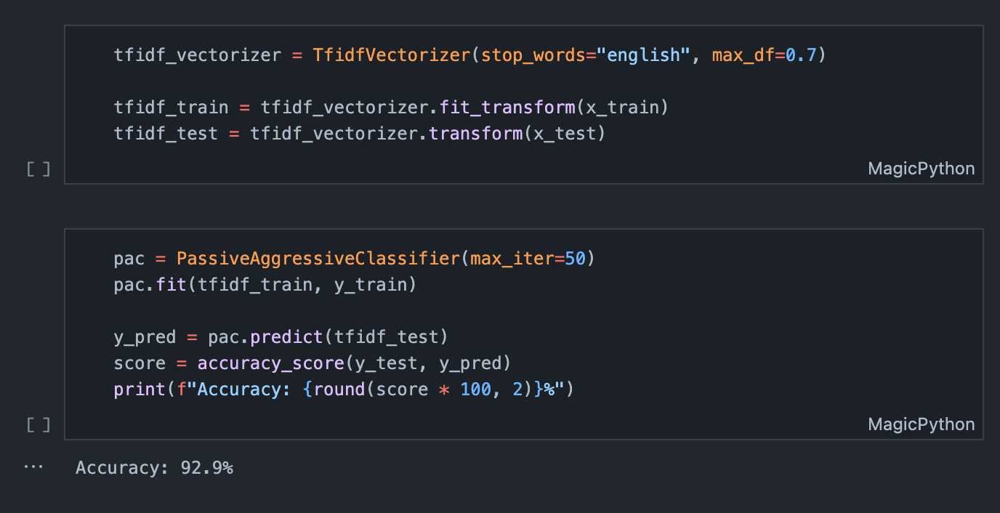

# Fake News Detection Model
A fake new classification model implemented using scikit-learn in python.

## About Project
A fake news detection passive aggressive classification model impolemented in python. The model was trained on the "news.csv" file and has 90+ percent accuracy.


## Usage
1. Install the required packages.
   ```bash
    conda install pandas numpy scikit-learn matplotlib
   ```
   or
   ```bash
   pip install pandas numpy scikit-learn matplotlib
   ```
2. Run "fake_news_detection.ipynb" file to see the result of the model. 
